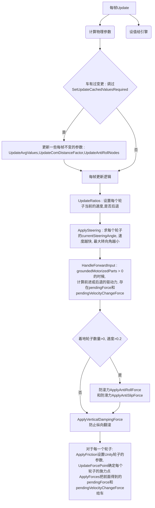

### 罗博造造——轮子

    其中：ApplyAntiSlipForce防滑力的计算方法如下：
    0、 前后轮，分两组
    1、 计算每组轮子的平局施力点forcePoint和sidewaysSlip向量之和val4
    2、 float num = Mathf.Clamp01((float)(node.numGroundedWheelsComponent.groundedParts - 1) / 3f);
    3、 Vector3 force = -val4 * (num / 轮子数);
    4、 num的计算比较有意思，可以参考一下
    
    

